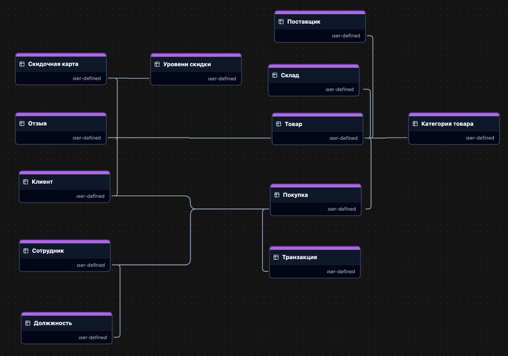
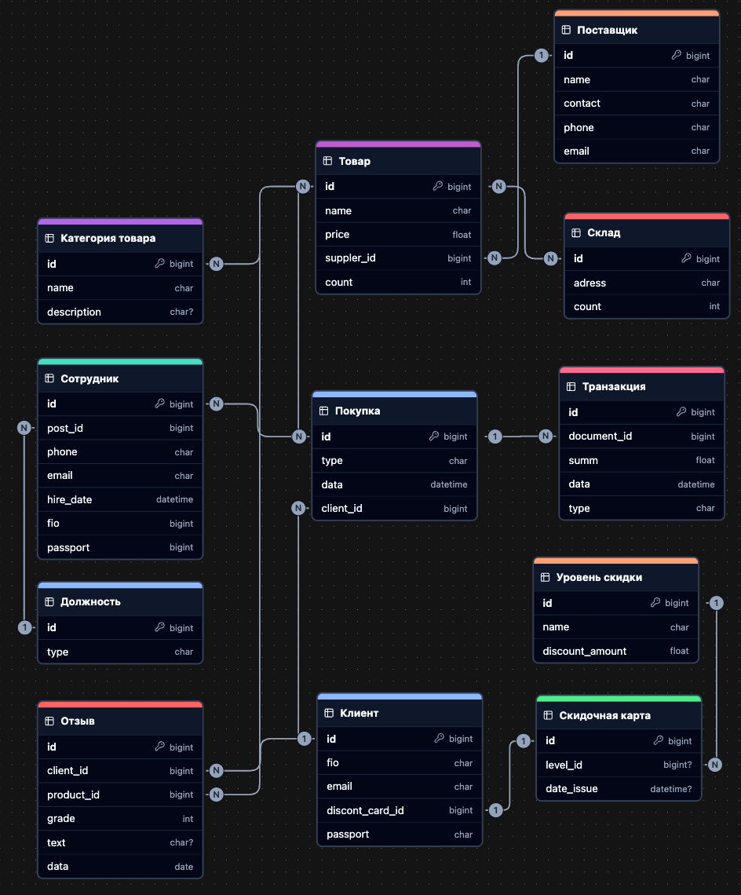

# Sports-Store-DB-Project

## О проекте

Это учебный пет-проект, созданный для демонстрации навыков проектирования и разработки реляционных баз данных. Цель проекта - создать с нуля полноценную базу данных для вымышленного магазина спортивных товаров, которая позволяет хранить информацию о продажах, клиентах, товарах и складских остатках, а также выполнять запросы.

Проект охватывает полный цикл работы с БД:
*   Создание концептуальной, логической и физической моделей данных.
*   Написание DDL-скриптов для создания схемы базы данных.
*   Написание DML-скриптов для наполнения БД тестовыми данными.
*   Составление аналитических SQL-запросов.


## Инструменты и технологии

*   **СУБД:** PostgreSQL
*   **Язык:** SQL
*   **Клиент для БД:** DBeaver
*   **Инструменты моделирования:** ChartDB.io


## Структура репозитория

*   `models/`
    *   `├──` [`conceptual_model.png`](https://github.com/Fezli/Sports-Store-DB-Project/blob/main/models/conceptual_model.png) — Концептуальная модель
    *   `├──` [`logical_model.png`](https://github.com/Fezli/Sports-Store-DB-Project/blob/main/models/logical_model.png) — Логическая модель
    *   `└──` [`physical_model.png`](https://github.com/Fezli/Sports-Store-DB-Project/blob/main/models/physical_model.png) — Физическая модель
*   `scripts/`
    *   `├──` [`ddl-schema.sql`](https://github.com/Fezli/Sports-Store-DB-Project/blob/main/scripts/ddl_schema.sql) — DDL-скрипт для создания схемы БД
    *   `└──` [`dml-data.sql`](https://github.com/Fezli/Sports-Store-DB-Project/blob/main/scripts/dml_data.sql) — DML-скрипт для наполнения БД

## Этапы проектирования базы данных

Проект был реализован в три этапа.  
**Каждый этап ниже можно развернуть, чтобы увидеть соответствующую диаграмму.** 

<details>
<summary><strong>1. Концептуальная модель (Conceptual Model)</strong></summary>

На этом этапе были определены ключевые сущности (например, "Клиент", "Товар", "Покупка") и основные связи между ними без какой-либо детализации.



</details>

<details>
<summary><strong>2. Логическая модель (Logical Model)</strong></summary>

На этом этапе концептуальная модель была детализирована: для каждой сущности были определены атрибуты, первичные ключи и установлены типы связей (один-ко-многим, многие-ко-многим).



</details>

<details>
<summary><strong>3. Физическая модель (Physical Model) - Финальная схема</strong></summary>

Это финальная, готовая к реализации схема. Логическая модель была адаптирована под СУБД PostgreSQL: определены точные типы данных (например, `VARCHAR`, `BIGSERIAL`, `TIMESTAMP`), добавлены ограничения (`NOT NULL`) и реализованы связи "многие-ко-многим" через связующие таблицы.

</details>

Физическая модель данных, реализованная в проекте:


## Как запустить проект

1.  Клонируйте репозиторий:
    ```bash
    git clone git@github.com:Fezli/Sports-Store-DB-Project.git
    ```
2.  Создайте новую базу данных в вашей СУБД PostgreSQL.
3.  Последовательно выполните SQL-скрипты из папки `/scripts`:
    *   `ddl_schema.sql` — для создания таблиц и связей.
    *   `dml_data.sql` — для заполнения таблиц тестовыми данными.
